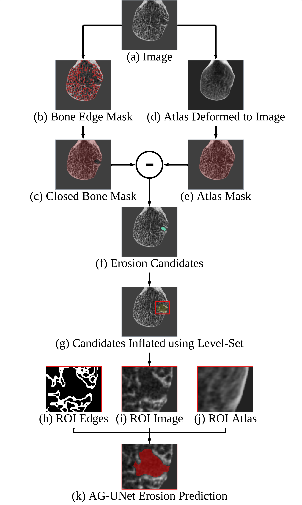
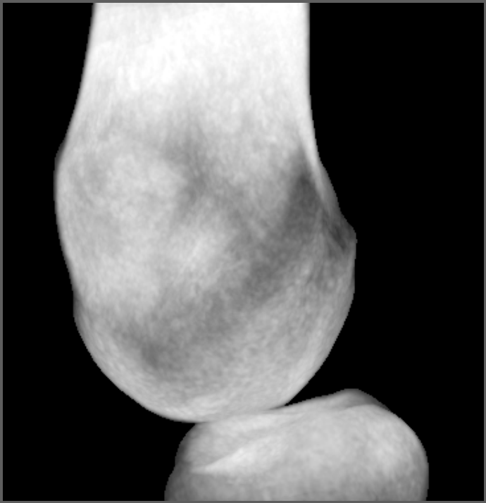
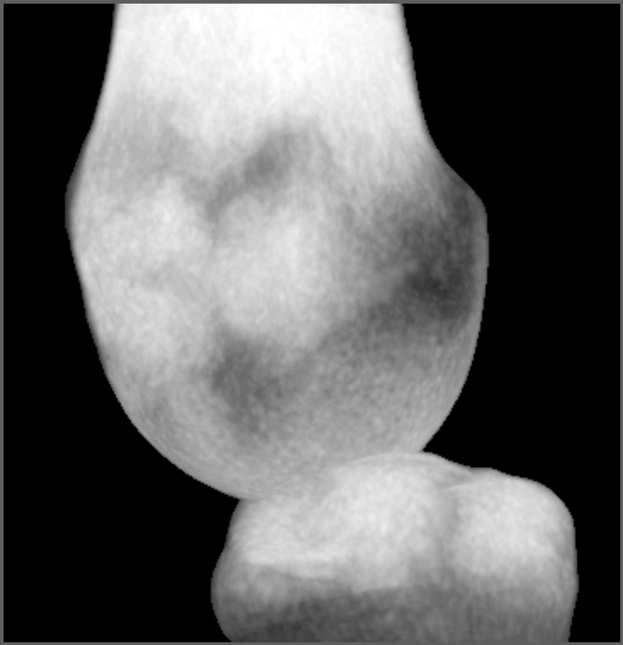
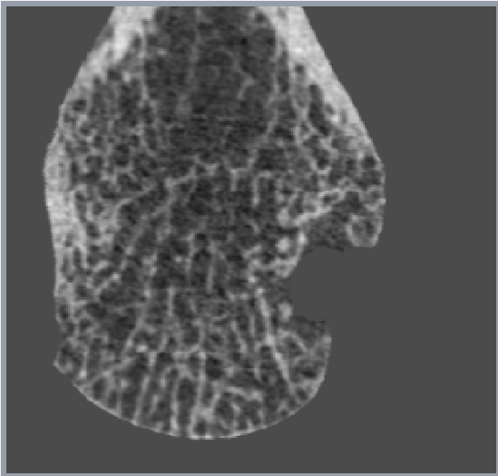
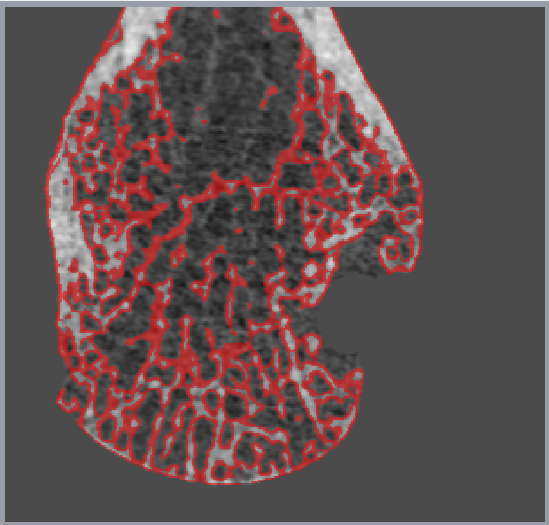
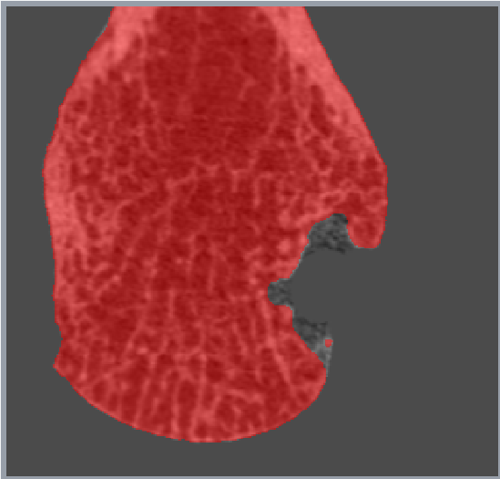

# BoneAGUNet

Atlas-guided erosion segmentation for an already-cropped MCP2 or MCP3 joint
image stack. The package interface deliberately excludes cohort discovery,
SLURM, and ARC filesystem paths.

## Pipeline overview

<p align="center">
  
</p>

The input image is converted into an edge mask and a closed bone mask while a
healthy atlas is deformably registered to the same anatomy. Their difference
identifies erosion candidates. Each candidate is passed to AG-UNet as a
three-channel ROI containing the image, bone edges, and registered atlas.

## Installation and use

```bash
git clone https://github.com/ManskeLab/BoneAGUNet.git
cd BoneAGUNet
pip install .
boneagunet-install ~/.cache/boneagunet
boneagunet -i joint_mcp2.nii.gz -o erosions.nii.gz --mcp 2
```

Python:

```python
from boneagunet import run
run("joint_mcp3.nii.gz", "erosions.nii.gz", mcp=3)
```

ANTs (`antsRegistration` and `antsApplyTransforms`) must be installed separately.
The package installs the pinned Manske Lab nnU-Net fork required by the attention
checkpoints.

The input is one unprocessed, already stack-registered 3-D MCP joint image. The
pipeline performs soft-tissue stripping, MC/PP masking, edge and closed-edge
prediction, atlas registration, candidate extraction, erosion prediction, and
recombination into the input image geometry. `--keep-work` preserves all
intermediates for inspection.

Use `--modality sr-cbct` for SR-CBCT inputs; HR-pQCT is the default.

## Atlases and intermediate masks

<table>
  <tr>
    <th>MCP2 atlas</th>
    <th>MCP3 atlas</th>
  </tr>
  <tr>
    <td></td>
    <td></td>
  </tr>
</table>

The healthy representative HR-pQCT atlases are shown as sagittal maximum
intensity projections.

<table>
  <tr>
    <th>Input image</th>
    <th>Predicted edge mask</th>
    <th>Closed bone mask</th>
  </tr>
  <tr>
    <td></td>
    <td></td>
    <td></td>
  </tr>
</table>

The second segmentation model receives both the image and predicted edge mask
to complete the cortical surface used during atlas subtraction.

## Hugging Face asset layout

Do not upload training data, cross-validation predictions, logs, or both best and
final checkpoints. Publish only the inference files below:

```text
models/
  strip/Dataset001_hand/nnUNetTrainer__nnUNetPlans__3d_fullres/
    dataset.json
    plans.json
    fold_all/checkpoint_best.pth
  edge/Dataset001_mcp/nnUNetTrainer__nnUNetPlans__3d_fullres/
    dataset.json
    plans.json
    fold_all/checkpoint_final.pth
  closed_edge/Dataset001_mcp/nnUNetTrainerWithAttention__nnUNetPlans__3d_fullres/
    dataset.json
    plans.json
    fold_all/checkpoint_final.pth
  erosion/Dataset001_mcp/nnUNetTrainerWithAttention__nnUNetPlans__3d_fullres/
    dataset.json
    plans.json
    fold_all/checkpoint_final.pth
atlases/
  mcp2/atlas_mc.nii.gz
  mcp2/atlas_pp.nii.gz
  mcp3/atlas_mc.nii.gz
  mcp3/atlas_pp.nii.gz
manifest.json
```

The source ARC names for MC are `atlas_mc_aligned.nii.gz`; rename them to
`atlas_mc.nii.gz` in the published bundle. Total checkpoint size is about 1.6 GB;
the four selected atlases add about 122 MB.

Assets are published at
[YousifKhoury/BoneAGUNet](https://huggingface.co/YousifKhoury/BoneAGUNet) and are
downloaded automatically or explicitly with `boneagunet-install`.

## Processing geometry

The trained models expect the inherited pipeline's 1 mm working header, so voxel
values are not interpolated before inference. Candidate physical measurements and
distance thresholds use the original input spacing. The final mask receives the
original input spacing, origin, and direction.
